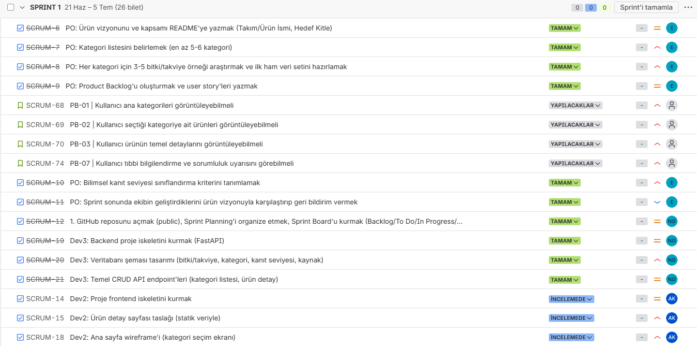
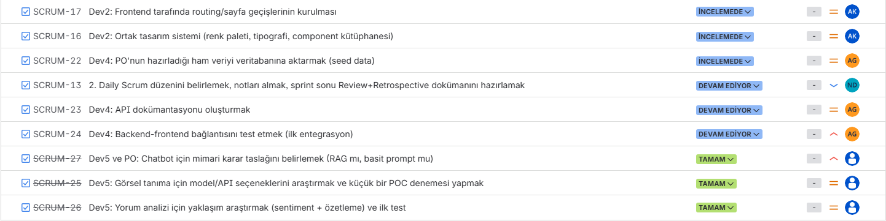
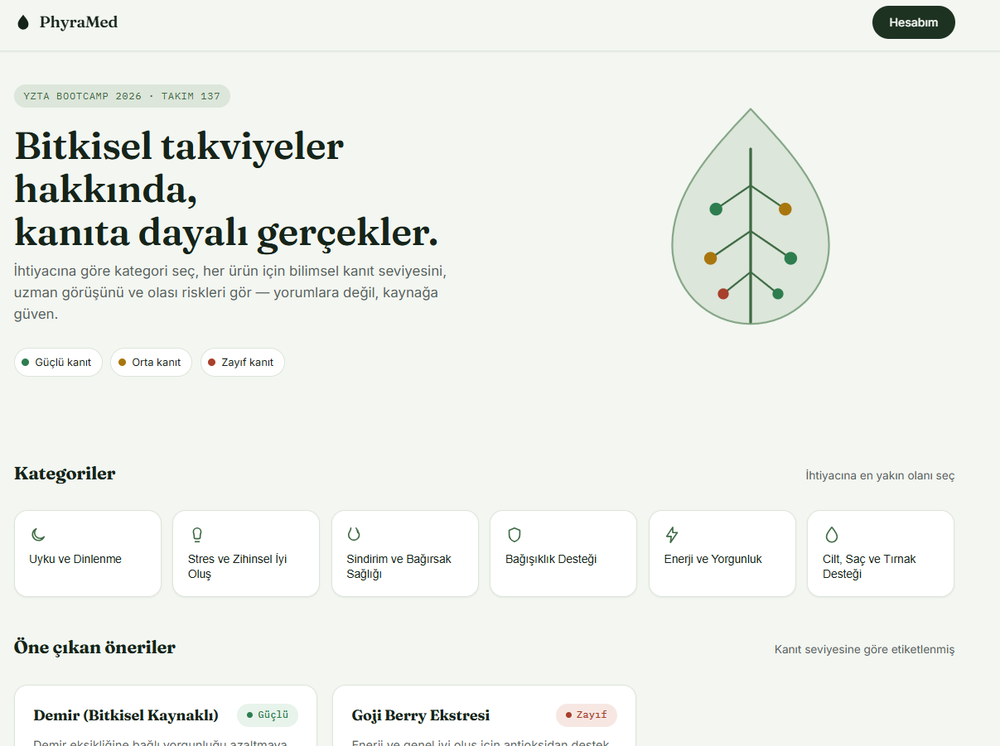
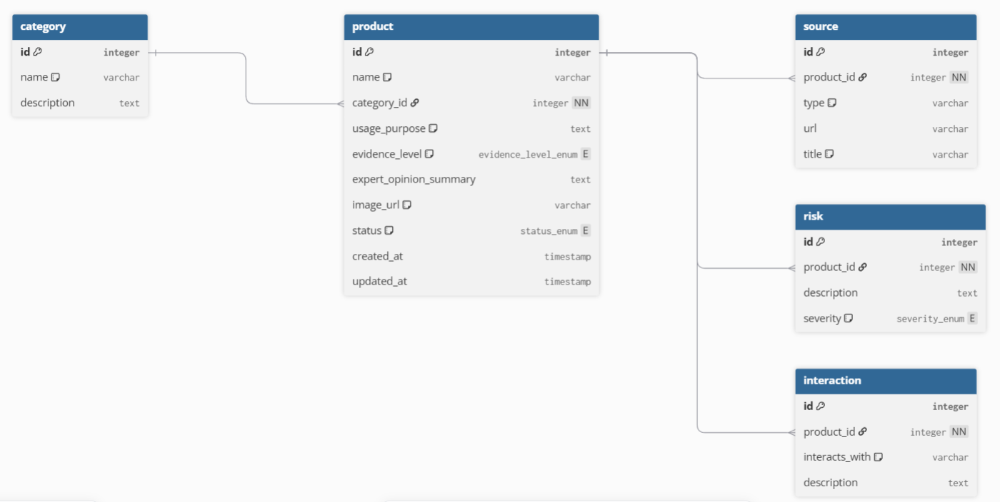

# PhyraMed Frontend

Build aracı veya framework kullanılmamıştır; proje düz HTML/CSS/JS ile
geliştirilmiştir.
=======
<p align="center">
  
</p>

# Takım 137

## Ürün ile İlgili Bilgiler


## Çalıştırma


Kurulum gerekmez. `index.html` dosyası tarayıcıda açılarak çalıştırılabilir.

## Klasör yapısı

```
index.html            Anasayfa
pages/
  urun.html            Ürün detay sayfası (?id= parametresiyle çalışır)
  profil.html          Profil ve geçmiş aramalar sayfası
  gorsel-tanima.html   Bitki fotoğrafı yükleme ve tanıma sonucu sayfası
css/style.css          Tasarım sistemi
js/
  data.js              Mock veri (backend modelleriyle uyumlu)
  main.js              Ortak bileşenler ve arayüz mantığı
```

## Teknik notlar

- Navbar, footer ve chatbot bileşenleri `js/main.js` üzerinden tüm
  sayfalara enjekte edilir; tekrar eden HTML bulunmaz.
- Veri alanları backend'deki `models/*.py` yapısıyla birebir uyumludur.
  API entegrasyonunda `js/data.js` içindeki mock veriler `fetch()`
  çağrılarıyla değiştirilir, sayfa tarafında ek değişiklik gerekmez.
- Kullanıcıdan/veritabanından gelen tüm metin alanları `escapeHTML()`
  ile işlenir.
- Veri yüklenirken iskelet (skeleton) bileşenleri gösterilir.
- Script'ler `defer` ile yüklenir; tek bir `PhyraMed` nesnesi altında
  toplanır.

## Sorumluluk reddi

Platformun tıbbi teşhis/tedavi amacı taşımadığı bilgisi footer'da,
ürün detay sayfasında ve chatbot'un ilk mesajında belirtilmiştir.

## Görev karşılıkları

| Görev | Konum |
|---|---|
| SCRUM-14: Frontend iskeleti | tüm proje |
| SCRUM-15: Ürün detay sayfası taslağı | `pages/urun.html` |
| SCRUM-16: Ortak tasarım sistemi | `css/style.css` |
| SCRUM-17: Routing/sayfa geçişleri | `pages/` klasörü, navbar |
| SCRUM-18: Ana sayfa wireframe'i | `index.html` |
| SCRUM-35/53: Chatbot arayüzü ve animasyonu | `js/main.js` → `initChatbot()` |
| SCRUM-36: Ürün detay sayfası (tüm alanlar) | `pages/urun.html` |
| SCRUM-37: Görsel yükleme arayüzü | `pages/gorsel-tanima.html` |
| SCRUM-54: UI/UX cilalama | `css/style.css` |
| Profil + geçmiş aramalar | `pages/profil.html` |

## PO içerik standardıyla uyum

GitHub'daki `docs/product-management/` altında PO tarafından yayımlanan iki
doküman (`evidence-classification.md`, `product-card-content-standard.md`)
bazı terminoloji ve davranış kuralları tanımlıyor; bu sürümde uygulandı:

- Ürün detayında "Uzman/doktor görüşü özeti" başlığı kaldırıldı, yerine
  bağlayıcı terim olan **"Bilimsel kanıt özeti"** kullanıldı.
- `evidence_level` sadece Güçlü/Orta/Zayıf değil, **Bekliyor** ve
  **Değerlendirilemedi** durumlarını da alabiliyor; bunlar birer kanıt
  seviyesi olmadığı için renkli rozet yerine nötr gri bir durum ifadesiyle
  gösteriliyor (`js/main.js` → `evidenceBadgeText()`, `evidenceStatusNote()`).
  Gerçek MVP veri setindeki 18 kaydın tamamı şu an "Bekliyor" durumunda,
  mock veriye bunu örnekleyen bir kayıt eklendi (id: 103).
- Risk, etkileşim ve kaynak bilgisi eksik olduğunda alan boş bırakılmıyor;
  standartta tanımlanan durum cümleleri gösteriliyor (ör. "Bilgi bulunmaması
  ürünün risksiz olduğu anlamına gelmez").
- Kategori adı ve açıklamaları `data/phyramed_mvp_seed_dataset_v1.xlsx`
  (Categories sekmesi) ile birebir eşleştirildi.

**Açık nokta:** Backend modelindeki (`models/product.py`) alan adı hâlâ
`expert_opinion_summary`; PO dokümanı bunun `evidence_summary` anlamıyla
yeniden eşleştirilmesi gerektiğini belirtiyor (SCRUM-30 kapsamında). Bu,
backend/veri ekibinin kararı — frontend tarafında sadece ekrandaki başlık
güncellendi, veri alanı adı değişmedi.

## Git akışı

```bash
git checkout develop
git pull
git checkout frontend/dev2-ahmet
git merge develop
git add .
git commit -m "[SCRUM-XX] açıklama"
git push origin frontend/dev2-ahmet
```
=======
- **Enes Tüysüz:** Product Owner - Developer
- **Nehir Doğan:** Scrum Master - Developer
- **Melike Şenses:** Developer
- **Alper Güler:** Developer
- **Ahmet Kılıç:** Developer

## Ürün İsmi

**PhyraMed**

## Ürün Açıklaması

PhyraMed, bitkisel takviyeler ve doğal ürünler hakkındaki kullanım iddialarını bilimsel kaynaklar doğrultusunda anlaşılır biçimde sunmayı amaçlayan, yapay zekâ destekli bir bilgilendirme platformudur.

Kullanıcılar; uyku ve dinlenme, stres ve zihinsel iyi oluş, sindirim ve bağırsak sağlığı, bağışıklık desteği, enerji ve yorgunluk ile cilt, saç ve tırnak desteği kategorilerindeki bitki ve takviyeleri inceleyebilir.

Platformda her ürün-kullanım iddiası için bilimsel kanıt seviyesi, kısa bilimsel özet, ilgili kaynaklar, temel riskler, olası yan etkiler ve etkileşim bilgilerinin sunulması hedeflenmektedir.

PhyraMed ayrıca fotoğraf yükleyerek olası bitki tanıma, kullanıcı yorumlarının yapay zekâ ile toplu analizi ve sohbet tabanlı bilgi erişimi özelliklerini kapsamaktadır.

## Ürün Özellikleri

- Altı ana kategori üzerinden bitki ve takviyeleri keşfetme
- Seçilen kategoriye ait ürünleri listeleme
- Ürünlerin temel bilgilerini ve kullanım iddialarını görüntüleme
- Her ürün-kullanım iddiası için bilimsel kanıt seviyesini görüntüleme:
  - Güçlü
  - Orta
  - Zayıf
- Bilimsel ve resmî kaynakları görüntüleme
- Risk, yan etki ve etkileşim bilgilerini görüntüleme
- Tıbbi bilgilendirme ve sorumluluk uyarısı
- Fotoğraf yükleyerek olası bitki tanıma
- Kullanıcı yorumlarının yapay zekâ ile toplu analizi
- Sohbet tabanlı yapay zekâ asistanı

## Hedef Kitle

- Bitkisel takviye veya doğal ürün satın almadan önce araştırma yapan kullanıcılar
- Bilimsel kanıtlarla pazarlama iddialarını ayırt etmek isteyen kullanıcılar
- Sağlıklı yaşam ve beslenme konularıyla ilgilenen kullanıcılar
- Online ürün yorumlarını daha kolay değerlendirmek isteyen kullanıcılar
- Karşılaştığı bir bitkiyi fotoğraf yoluyla tanımak isteyen kullanıcılar
- Güvenilir ve anlaşılır sağlık bilgisine ihtiyaç duyan 18 yaş ve üzeri genel kullanıcılar

## Proje Bağlantıları

- **Product Backlog ve Sprint Board:**  
  [PhyraMed Jira Sprint Board](https://grup137.atlassian.net/jira/software/projects/SCRUM/boards/1)

- **Product Backlog Dokümanı:**  
  [Product Backlog](docs/product-management/product-backlog.md)

- **Bilimsel Kanıt Sınıflandırma Kriterleri:**  
  [Bilimsel Kanıt Sınıflandırması](docs/product-management/evidence-classification.md)

- **MVP Veri Seti:**  
  [PhyraMed MVP Seed Dataset](data/phyramed_mvp_seed_dataset_v1.xlsx)

> **Tıbbi bilgilendirme:** PhyraMed teşhis koymaz, tedavi önermez ve bir sağlık profesyonelinin görüşünün yerini tutmaz. Platform yalnızca bilgilendirme amacıyla hazırlanmaktadır. Kullanıcıların sağlıkla ilgili kararlar almadan önce uygun bir sağlık profesyoneline danışması gerekir.

---

# Sprint 1

**Sprint Tarihleri:** 19 Haziran – 5 Temmuz 2026

## Sprint Notları

Sprint 1 kapsamında ürün vizyonunun ve MVP kapsamının netleştirilmesi, Product Backlog'un oluşturulması, ilk veri setinin hazırlanması, teknik proje iskeletlerinin kurulması ve yapay zekâ özelliklerine yönelik araştırma çalışmalarının başlatılması hedeflenmiştir.

Product Owner çalışmaları kapsamında:

- Ürün vizyonu, kapsamı ve hedef kitlesi tanımlanmıştır.
- PhyraMed'in altı ana kategorisi belirlenmiştir.
- Her kategori için üç ürün olacak şekilde toplam 18 ürün-kullanım iddiasından oluşan ilk MVP veri seti hazırlanmıştır.
- PB-01 ile PB-10 arasındaki Product Backlog maddeleri oluşturulmuştur.
- User story'ler, kabul kriterleri, P0 öncelikleri ve hedef sprintler Jira üzerinde tanımlanmıştır.
- Güçlü, Orta ve Zayıf bilimsel kanıt seviyelerine ait sınıflandırma kriterleri hazırlanmıştır.

Takımın frontend, backend, veri entegrasyonu ve yapay zekâ araştırma görevleri Jira Sprint Board üzerinden takip edilmiştir. Sprint 1 son durumu, aşağıdaki Sprint Board Update ve Ürün Durumu bölümlerinde ekran görüntüleriyle belgelenmiştir.

## Backlog Düzeni ve Story Seçimleri

Sprint 1 backlog düzeni, PhyraMed MVP'sinin önce ürün temelini netleştirecek ve sonraki sprintlerde geliştirilecek özelliklere zemin hazırlayacak şekilde oluşturulmuştur.

Product Owner tarafında ilk olarak ürün vizyonu, hedef kitle ve MVP kapsamı tanımlanmıştır. Ardından ürünün veri yapısını ve kullanıcı akışını desteklemek amacıyla altı ana kategori belirlenmiş, her kategori için üç ürün olacak şekilde ilk MVP veri seti hazırlanmıştır.

Product Backlog, PB-01 ile PB-10 arasında ayrı user story kartları olarak düzenlenmiştir. Bu story'ler kullanıcı ihtiyacına göre yazılmış, her biri için kabul kriterleri oluşturulmuş, öncelik seviyesi P0 olarak belirlenmiş ve hedef sprint dağılımı yapılmıştır.

Sprint 1 için temel MVP akışını temsil eden aşağıdaki story'ler seçilmiştir:

- PB-01: Kullanıcı ana kategorileri görüntüleyebilmeli
- PB-02: Kullanıcı seçtiği kategoriye ait ürünleri görüntüleyebilmeli
- PB-03: Kullanıcı ürünün temel detaylarını görüntüleyebilmeli
- PB-07: Kullanıcı tıbbi bilgilendirme ve sorumluluk uyarısını görebilmeli

Bu story'lerin tamamlanması, ilgili frontend/backend geliştirme görevlerinin kabul kriterlerini karşılamasına bağlıdır. Bu nedenle Product Backlog kartlarının oluşturulması ile ürün özelliklerinin geliştirilmesi ayrı takip edilmektedir.

Sprint 2'ye planlanan story'ler ise bilimsel kanıt detayları, kaynak gösterimi, risk/etkileşim bilgileri, görsel tanıma, yorum analizi ve chatbot özellikleri üzerine ayrılmıştır:

- PB-04: Kullanıcı kullanım iddiasının bilimsel kanıt seviyesini görebilmeli
- PB-05: Kullanıcı bilimsel ve resmî kaynakları görüntüleyebilmeli
- PB-06: Kullanıcı risk, yan etki ve olası etkileşim bilgilerini görüntüleyebilmeli
- PB-08: Kullanıcı fotoğraf yükleyerek bitkiyi tanımlayabilmeli
- PB-09: Kullanıcı ürün yorumlarının toplu analizini görüntüleyebilmeli
- PB-10: Kullanıcı chatbot üzerinden ürün ve takviyeler hakkında bilgi alabilmeli

Story'ler Jira üzerinde `Yapılacaklar`, `Devam Ediyor`, `İncelemede`, `Tamamlandı` ve `Engellendi` durumlarıyla takip edilmiştir. Sprint 1'de story point ataması kullanılmadığı için ilerleme, görev durumları ve sprint çıktıları üzerinden değerlendirilmiştir.

## Sprint Puanlaması

Sprint 1 görevlerine story point ataması yapılmadığı için sprint ilerlemesi puan yerine Jira üzerindeki görev durumları üzerinden takip edilmiştir.

Story point kullanımına ilişkin kararın sonraki Sprint Planning çalışmasında ekip tarafından ortak şekilde değerlendirilmesi planlanmaktadır.

## Daily Scrum

Ekip içi günlük iletişim, görev güncellemeleri ve karşılaşılan engeller ağırlıklı olarak Slack üzerinden paylaşılmıştır.

Görevlerin resmî durumları Jira Sprint Board üzerinden takip edilmiş ve Sprint 1 son durumu README’ye eklenen board ekran görüntüleriyle belgelenmiştir.

## Product Backlog URL

[PhyraMed Jira Sprint Board](https://grup137.atlassian.net/jira/software/projects/SCRUM/boards/1)

## Sprint Board Update

Sprint 1 görevleri Jira Sprint Board üzerinden takip edilmiştir.

Aşağıda Sprint 1 sonunda güncellenen Jira Sprint Board ekran görüntüleri yer almaktadır.





## Ürün Durumu: Ekran görüntüleri

Sprint 1 kapsamında ürünün temel bilgi mimarisi, veri yapısı ve ilk arayüz taslağı hazırlanmıştır.

Frontend tarafında PhyraMed ana sayfa taslağı, kategori kartları, kanıt seviyesi etiketleri ve temel ürün kartı görünümü oluşturulmuştur. Bu ekran Sprint 1 için statik/taslak ürün arayüzü olarak değerlendirilmiştir.



Backend tarafında FastAPI proje iskeleti, temel veri modelleri ve veritabanı şeması hazırlanmıştır.



Sprint 1 içerisinde doğrulanmış olarak tamamlanan veya hazırlanan temel çıktılar şunlardır:

- Ürün vizyonu, ürün kapsamı ve hedef kitle tanımlanmıştır.
- PhyraMed'in altı ana kategorisi belirlenmiştir.
- Toplam 18 ürün-kullanım iddiasından oluşan ilk MVP veri seti hazırlanmıştır.
- Veri seti GitHub reposuna eklenmiştir.
- PB-01 ile PB-10 arasındaki Product Backlog maddeleri ve kabul kriterleri oluşturulmuştur.
- Product Backlog dokümanı GitHub reposuna eklenmiştir.
- Bilimsel kanıt seviyesi sınıflandırma kriterleri hazırlanmıştır.
- Kanıt sınıflandırma dokümanı GitHub reposuna eklenmiştir.
- GitHub reposu ve Jira Sprint Board oluşturulmuştur.
- Backend proje iskeleti ve veritabanı şeması hazırlanmıştır.
- Frontend ana sayfa/kategori ekranı için ilk taslak arayüz hazırlanmıştır.

CRUD endpoint'leri, seed data aktarımı, API dokümantasyonu, backend-frontend entegrasyonu ve AI POC çalışmalarının nihai durumu Sprint 1 kapanışındaki Jira durumuna göre takip edilmektedir.

## Sprint Review

Sprint Review, Sprint 1 sonunda takımın geliştirdiği çıktıların sprint hedefleri ve ürün vizyonuyla karşılaştırılması amacıyla gerçekleştirilecektir.

Review sırasında aşağıdaki başlıklar değerlendirilecektir:

- Sprint hedeflerine ulaşılma durumu
- Tamamlanan teknik ve ürün çıktıları
- Devam eden veya Sprint 2'ye aktarılacak görevler
- Geliştirilen çıktıların ürün vizyonuyla uyumu
- Tespit edilen ürün ve teknik eksikler

Sprint Review tamamlandıktan sonra toplantıda alınan kararlar bu bölüme eklenecektir.

## Sprint Review Katılımcıları

Sprint Review toplantısı tamamlandıktan sonra katılımcıların isimleri bu bölüme eklenecektir.

## Sprint Retrospective

Sprint Retrospective, Sprint 1 kapanışında Scrum Master koordinasyonunda gerçekleştirilecektir.

Retrospective kapsamında aşağıdaki konuların değerlendirilmesi planlanmaktadır:

- Ekip içi iletişim ve koordinasyon
- Görev dağılımının etkinliği
- Sprint içerisinde iyi ilerleyen çalışmalar
- Geciken veya tamamlanamayan görevlerin nedenleri
- Karşılaşılan engeller
- Sprint 2 için uygulanacak iyileştirmeler

Sprint Retrospective tamamlandıktan sonra alınan kararlar bu bölüme eklenecektir.

